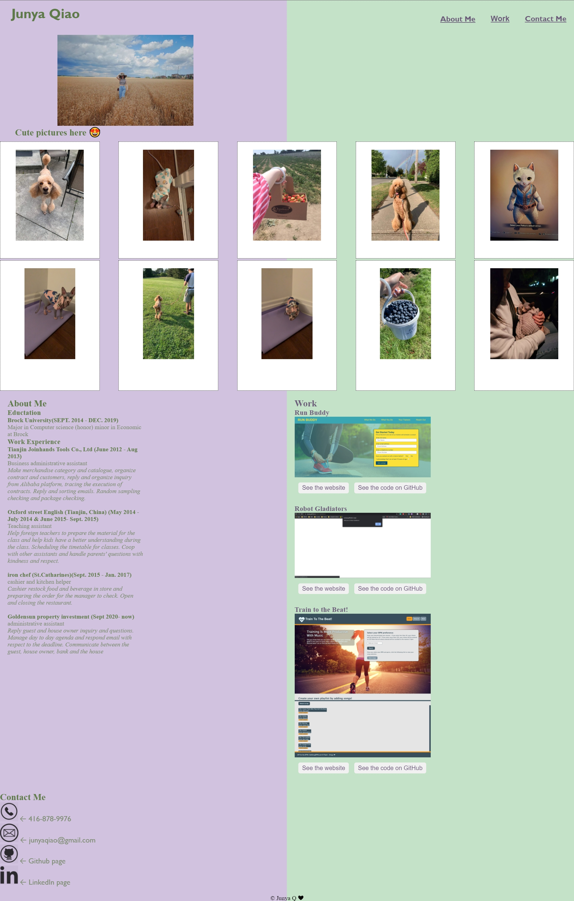

# bootcamp-challenge-02
This is Junya's portfolio page, with this page you can check the webpage work she has done so far.  
WHEN load the webpage,  
THEN it shows developer's name, recent phot, links to sections about them, thier work, and how to contact them  
WHEN click on the links in the necigation  
THEN webpage scrolls down to the corresponding section  
WHEN click on the links to the section about about the work (can choose from different work, or entire section)  
THEN it go to that work, with images of each work  
WHEN presented with the developer's first application (hover)  
THEN application's image larger in size than the other  
WHEN click on the image of the application  
THEN taken to the deployed webpage  
WHEN click on two buttons under the webpage picture for each work  
THEN it bring to the github code / deployed webpage  
WHEN change the screen size  
THEN the position of the pictures changes 

Here is the image for the deployed webpage: 
 
This portfolio webpage shows some recent pictures, has some recent webpage works and contact information 
WHEN hover each pictures to see the description of the picture,  
WHEN click on the navigate bar, THEN scroll to that section 
WHEN hover the work in navigate bar, THEN shows all the works you can select from  
WHEN choose work from the dropdown list, THEN scroll to that work on this page 
WHEN click on the image of the work, THEN bring to the delopyed webpage 
WHEN click on the visit webpage button, THEN bring to the depolyed webpage  
WHEN click on the visit code button, THEN bring to the git hub repository to see the code  
WHEN click on the contact me on the navigate bar, THEN scroll to contact me section  
WHEN click on the symbol for call me, email me, github or link in, THEN make webcall, send me email, or visit my github or linkedin  

created by Junya Q

Delopyed URL for this website: https://junyaq.github.io/bootcamp-challenge-02/  
